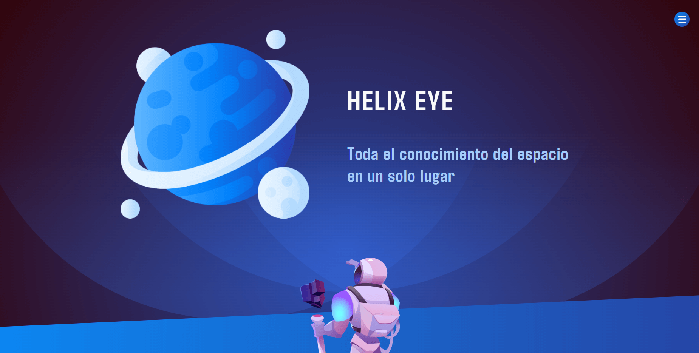

# Helix Eye
This is a project with the goal of learn and practice SSR in React.

### Built with

- Semantic HTML5 markup
- CSS custom properties
- Flexbox
- CSS Grid
- [React Router](https://reactrouter.com/en/main)
- [React](https://reactjs.org/) - JS library
- [Styled-components](https://styled-components.com) - For styles

### Screenshot



### Install dependencies

```
yarn 
```

### Development

```
yarn dev
```


### Production

```
yarn start
```
